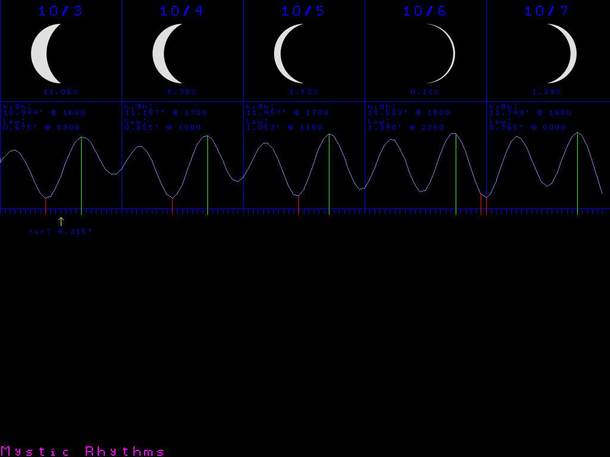
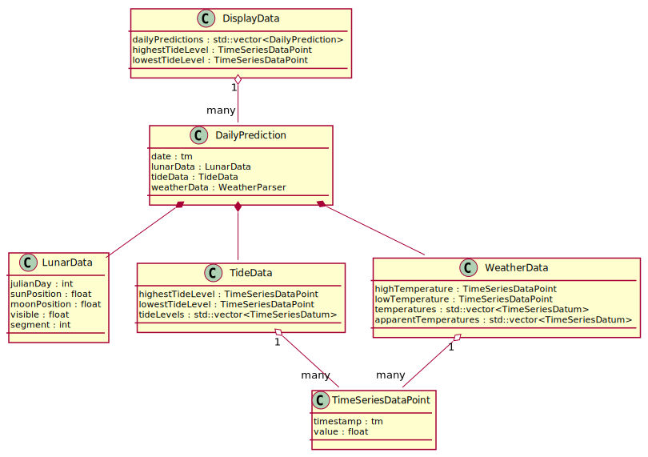
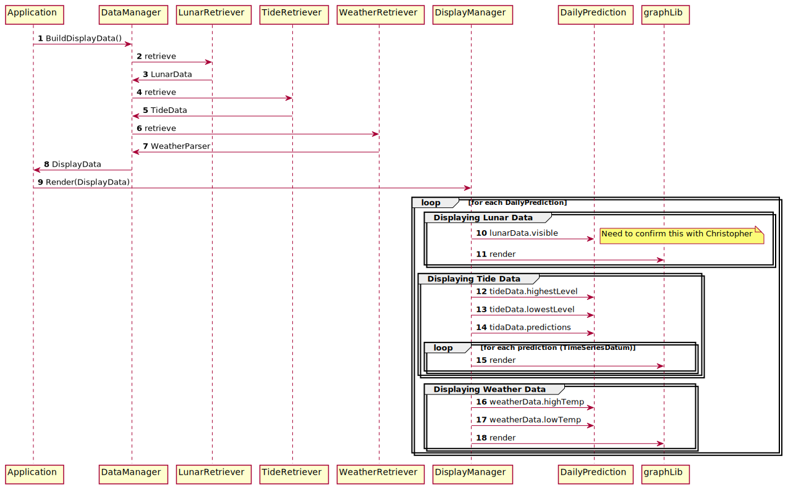

# tidal

**tidal** is software that pulls data from various sources and renders the data on a Raspberry Pi - driven 
display. The impetus for creating this project was to have the ability to see the tide levels at a glance 
to help facilitate activity on our local bay; kayaking, swimming, fishing, etc. 




## tidal data model

### Sources

There are three sources of data for tidal:

1. Lunar Data: [lunar library](https://github.com/ciroque/lunar)
2. Tide Data: [NOAA Tide Data API](https://api.tidesandcurrents.noaa.gov/api/prod/)
3. Weather Data: [National Weather Service API](https://www.weather.gov/documentation/services-web-api)

Each source has an associated *Retriever class that connects to the service to gather the data for its respective data.

#### Lunar Phase Data - lunar library

This is a library that calculates the phase of the moon based on historically known locations. Given a Julian Date the library
returns a data structure with this shape:

```c
struct Phase {
    int julianDay;
    double sunPosition;
    double moonPosition;
    double visible;
    Segment segment;
};
```

#### Tide Data - NOAA Tide Data API

This is a web service provided by the National Oceanic and Atmospheric Administration. Details of the JSON format / content 
returned from the service can be found in [the api documentation](https://www.weather.gov/documentation/services-web-api).

A sample of the data can be found [in the docs directory](./RawTideData.json).

#### Weather Data - National Weather Service API

This is a web service provided by the National Weather Service. Details of the JSON format / content returned from the service
can be found in [the api documentation](https://www.weather.gov/documentation/services-web-api).

A sample of the data can be found [in the docs directory](./RawWeatherData.json).

### Transformation

The data from the different sources is disparate enough that a transformation step is needed to alter the shape of the to
make rendering the data easier. The classes that represent the data internally to tidal follow this model:



The primary motivation for this data model is to shape the data into a form that allows tidal to show the data for a given day.
The DisplayManager should not have the responsibility of correlating data from across the different data sources. 
That correlation should be the responsibility of a focused class, the DataManager class.

#### Transformation process

As noted above, each data source has an associated *Retriever class that handles communication with the associated service.

These Retrievers are currently managed by the Application class. As part of the data refactoring project this logic will
be moved into the DataManager class. The DataManager class will be responsible for taking the data retrieved from each source and combining
it into a DisplayData instance. The DisplayData instance will then be handed off to the DisplayManager for rendering.

The following diagram shows the high-level logic flow.



## Contributors

- [DoctorAkula (aka Bob)](https://github.com/doctorakula)
- [ciroque](https://github.com/ciroque)
